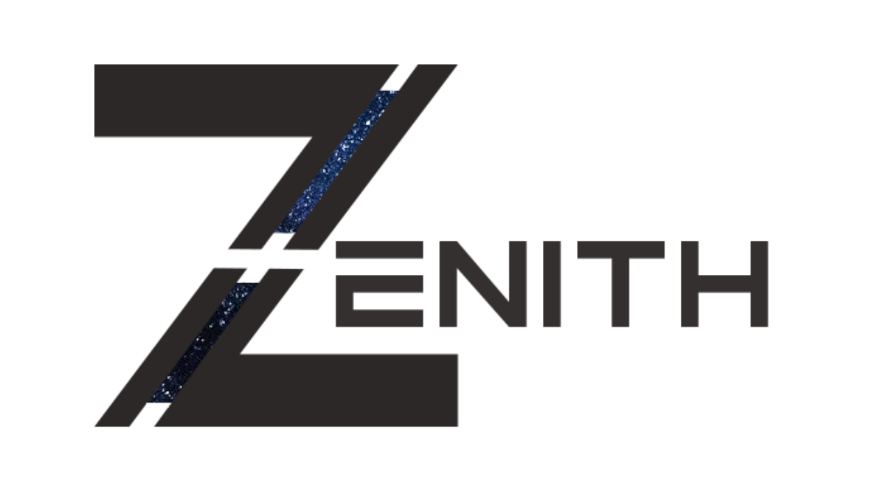

# Zenith

Zenith is an extensible, **C++ based game engine** replete with **PBR**, built in **UI functionality**, **Lua scripting** (**WIP**) and a **custom object format (.zof)**. The project is currently under development so none of these features are guaranteed to be stable yet. There are many other features and additions that I will implement as time passes. Keep reading to get started. [**NO LONGER MAINTAINED**. Working on something new and improved :)] 

### Current Status

## Requirements

* CMake, available for download at [https://cmake.org/download/](https://cmake.org/download/)
* An Apple computer with any of the latest macOS images

  **OR**
  
* A 64 bit Windows installation, in which case you will also need Visual Studio, available for download at [https://visualstudio.microsoft.com/vs/community/](https://visualstudio.microsoft.com/vs/community/)

## Downloading

Please make sure to clone the repository from a command line using 

`git clone https://github.com/gitbetter/Zenith.git`

or using your favorite Git desktop GUI client. Zenith uses LFS to store certain sizable files, so downloading directly via the ZIP option will not resolve the git LFS links, and you will most likely encounter errors when attempting to run the project.

## Building and Running

Make sure that you have met the requirements above. There is currently no way to build the project without CMake, and you might be left out in the cold if you try to run on any Linux distro or older Windows/OSX versions, as these have not yet been tested. Use the provided build tool (`build.ps1` on Windows, `build.sh` on macOS) to generate project files and build the engine. Check out the [Building](https://github.com/gitbetter/Zenith/wiki/Building) page for the full rundown on the provided build tool.

## Overview

Take a look at the **[Zenith Wiki](https://github.com/gitbetter/Zenith/wiki)** for more info, but keep in mind that it is not an authoritative API reference. To that end, perusing the headers and source files is a much better idea. In case you're wondering why the project size is so large, most if it resides in the Assets directory, which contains some hefty demo textures, but they are by no means required for the engine to run properly, and you are free to play with your own assets if you have any laying around. Stay tuned for more developments.

## License
Zenith is available under the MIT License, and therefore anyone is free to fork the project and modify it to their hearts content as long as they maintain attributions to the original author of the project.

## Contributing
If you wish to contribute to this project (at which you have my many thanks), please submit any pull requests you may have to the Gold branch and not master, as it is easier for me to integrate changes selectively if need be. If you have any inquiries or particularly nice ideas, feel free to contact me via [my Twitter](https://twitter.com/AdrianS43153229)
